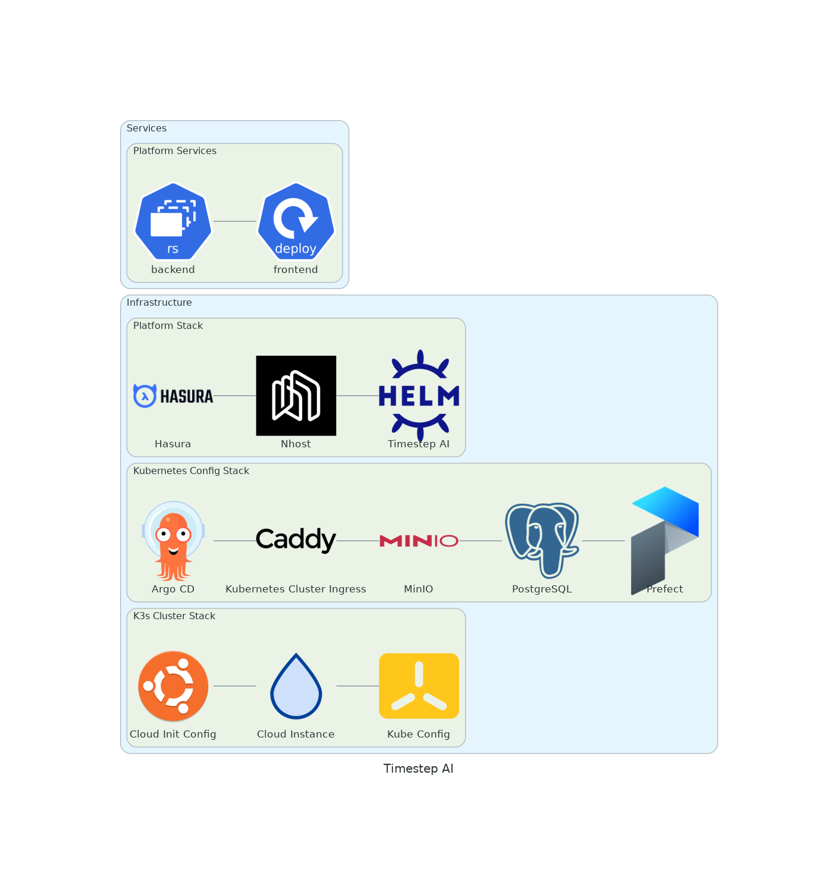

# Timestep AI

<!-- [](https://agentprotocol.ai/compliance) -->

[](https://github.com/psf/black)
[](https://github.com/pre-commit/pre-commit)
[](https://github.com/astral-sh/ruff)

[](https://www.digitalocean.com/?refcode=2184d1107783&utm_campaign=Referral_Invite&utm_medium=Referral_Program&utm_source=badge)

## Architecture

<!-- ```mermaid
classDiagram
    class Agent {
        + models: List[str]
        + model_iter(): Iterator[str]
    }

    class Environment {
        + agents: List[str]
        + agent_iter(): Iterator[str]
        + step()
    }

    Agent --|> Environment
``` -->



<!--  -->

## TODO:

from shimmy import GymnasiumMultiAgentCompatibilityV0 -->

## Requirements

- [arkade](https://github.com/alexellis/arkade#getting-arkade)
- [direnv](https://direnv.net/)
- [Multipass](https://multipass.run/install)

## Installation

### Environment Configuration

#### Secrets

##### Local

```bash
secrets/argo_cd_private_repo_access_token # TODO: Remove; private repo access to this from ArgoCD
secrets/do_token
secrets/docker_registry_password
secrets/hasura_graphql_admin_secret
secrets/hasura_graphql_jwt_secret_key
secrets/minio_root_password
secrets/pgpool_admin_password
secrets/postgresql_password
secrets/postgresql_repmgr_password
secrets/smtp_password # Gmail app password
secrets/ssh_private_key # `make ssh-keygen` # TODO: Do this better somehow; i.e., don't require manual intervention to generate/replace the key
secrets/ssh_public_key # TODO: Move to variables
secrets/tf_api_token
```

##### Remote (GitHub Actions Secrets)

```bash
ARGO_CD_PRIVATE_REPO_ACCESS_TOKEN
DO_TOKEN
DOCKER_REGISTRY_PASSWORD
HASURA_GRAPHQL_ADMIN_SECRET
HASURA_GRAPHQL_JWT_SECRET_KEY # >= 32 characters
MINIO_ROOT_PASSWORD
PGPOOL_ADMIN_PASSWORD
POSTGRESQL_PASSWORD
POSTGRESQL_REPMGR_PASSWORD
SMTP_PASSWORD
SSH_PRIVATE_KEY
SSH_PUBLIC_KEY
TF_API_TOKEN
```

#### Variables

##### Local and Remote (GitHub Actions Variables)

Copy `.env.example` to `.env` and ajust the values as needed. The following variables are also required:

```bash
ARGO_CD_PRIVATE_REPO_USERNAME # TODO: {{cookiecutter.github_username}}, etc.
CI_REGISTRY_IMAGE
CLOUD_INSTANCE_NAME
DOCKER_REGISTRY_EMAIL
DOCKER_REGISTRY_SERVER
DOCKER_REGISTRY_USERNAME
INGRESS_CONTROLLER_EMAIL
SMTP_SENDER
SMTP_USER
TF_HTTP_ADDRESS
TF_USERNAME
```

##### GitHub Action Variables

```bash
direnv allow
make # Will need to be run twice on the first run (after installing k3s inside the multipass VM)
make hosts # In a separate terminal
```

## Usage

```bash
open https://${PRIMARY_DOMAIN_NAME}
```
