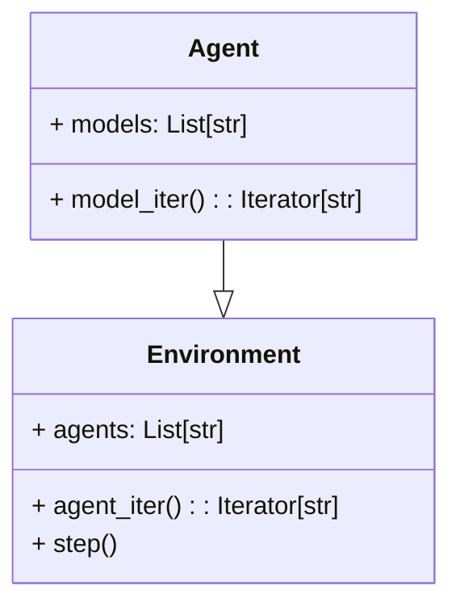

# Timestep AI

```mermaid
classDiagram
    class Agent {
        + models: List[str]
        + model_iter(): Iterator[str]
    }

    class Environment {
        + agents: List[str]
        + agent_iter(): Iterator[str]
        + step()
    }

    Agent --|> Environment
```

## TODO:

from shimmy import GymnasiumMultiAgentCompatibilityV0
